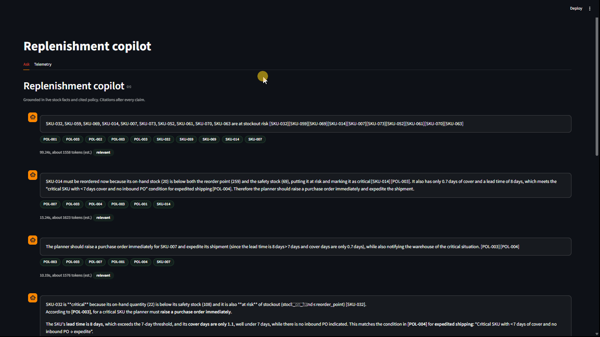

# replenish-copilot

[](pyproject.toml)
[](src/app.py)
[](src/rag.py)
[-orange)](architecture.md)
[](tests/)
[](docker-compose.yml)

A RAG-based **inventory replenishment and supplier-delay decision-support
copilot**. It answers planner questions such as *"Which SKUs are at stockout
risk?"* or *"Which supplier delays are violating SLA?"* by combining
**computed operational facts** from live inventory data with **cited company
policy**, in one grounded response. Every claim traces to a `SKU-XXX` row or a
`POL-00X` document — or the system says *"I don't know."*



## Contents

- [Problem](#problem)
- [How it works](#how-it-works)
- [Architecture](#architecture)
- [Quickstart](#quickstart)
- [Configuration](#configuration)
- [Evaluation](#evaluation)
- [Monitoring](#monitoring)
- [Project structure](#project-structure)
- [Reproducibility](#reproducibility)
- [Roadmap](#roadmap)

## Problem

Inventory planners juggle stockout risk, reorder timing, and supplier delays
across dozens of SKUs using static reports plus tribal SOP knowledge. A bare
LLM cannot answer *"Should SKU-014 be reordered now?"* — it has no access to
live stock levels and no knowledge of company reorder or SLA policy, so it
guesses. Wrong guesses here cost real money: stockouts on one side, cash tied
up in overstock on the other.

`replenish-copilot` closes that gap for one focused vertical slice —
**inventory replenishment and supplier-delay decisions**, not a full control
tower:

1. **Compute** facts from operational data: stock vs. reorder point,
   cover-days from demand history, SLA-breach aggregates from PO history.
2. **Retrieve** the governing policy: safety-stock formulas, SLA penalties,
   stockout prioritization, expedited shipping rules.
3. **Synthesize** both into a single answer with citations, in one
   deterministic pass. No agent loops, no guessing.

## How it works

```text
User question (Streamlit)
        |
        v
Deterministic router (code, not LLM)
  regex: SKU-XXX, SUP-XX, POL-00X  +  keyword intents
        |
   +----+----+
   |         |
   v         v
SQLite facts        Hybrid policy search (local)
stock/ROP/safety,   minsearch text top-5  +  MiniLM vector top-5
SLA aggregates,         RRF-merged (k=60),  boost on doc_id mention
cover-days
   |         |
   +----+----+
        |
        v
Fixed prompt (facts + cited chunks) -> one OpenRouter call (temp 0.0)
        |
        v
Answer + citations -> telemetry log (conversations + feedback)
```

An empty result on both routes returns *"I don't know."* Retrieval never
depends on the LLM, and the LLM never touches SQL directly — it only reasons
over what the router hands it.

## Architecture

Full design rationale lives in [`architecture.md`](architecture.md). Summary:

| Layer | Choice | Why |
|---|---|---|
| Fact store | SQLite (`data/replenish.db`) | 4 tables: inventory (75 SKUs), suppliers (15), purchase orders (150), demand (600 rows) |
| Policy index | minsearch text + MiniLM 384-dim vectors, RRF merge, sqlitesearch persistence | Local, free, fully reproducible — no external vector DB to provision |
| Policy documents | 7 SOP docs (`POL-001`–`POL-007`, 29 chunks) | Each carries a `doc_id` header used as the evaluation join key |
| Embeddings | `sentence-transformers all-MiniLM-L6-v2` | Free, CPU-friendly, baked into the Docker image |
| LLM | OpenRouter free tier (`OPENROUTER_MODEL`, default `google/gemma-4-26b-a4b-it:free`) | Swappable via `.env`; retries and an abstention fallback absorb free-tier flakiness |
| UI + dashboard | Streamlit (`src/app.py`) | Ask tab plus a 5-chart Telemetry tab |
| Telemetry | SQLite (`data/telemetry.db`) | `conversations` + `feedback` (user votes, online-judge verdicts) |
| Tests | Pytest (`tests/`) | 6 offline unit tests — no network or API keys required |
| Shipping | `Dockerfile` + `docker-compose.yml` | Single service, CPU-only torch, model weights baked into the image layer |

**Data provenance:** `supply_chain_dataset1.csv` (Kaggle, ~91k rows) seeds
realistic values — 50 real SKUs and 10 real supplier lead-times are sampled
into `data/csv/`, then topped up synthetically to the target sizes with a
fixed seed, so regeneration is byte-identical.

## Quickstart

Prerequisites: [`uv`](https://docs.astral.sh/uv/), Docker (for the container
path), an OpenRouter API key.

```bash
uv sync
cp .env.example .env          # set OPENROUTER_API_KEY

uv run python scripts/generate_data.py   # build data/csv/ + data/policies/
uv run python src/ingest.py              # load SQLite + build hybrid index
uv run streamlit run src/app.py          # http://localhost:8501
uv run pytest -q                         # 6 offline tests
```

Or everything in one container, no external services, model baked in:

```bash
docker-compose up --build
```

Sample questions to try:

- Which SKUs are at stockout risk this week?
- Why should SKU-014 be reordered now?
- Which supplier delays are violating SLA?
- What is the safety stock for SKU-032 and how was it calculated?
- What does the exception handling SOP say about demand spikes?

## Configuration

`.env` (never committed — see [`.env.example`](.env.example)):

```text
OPENROUTER_API_KEY=sk-or-...
OPENROUTER_MODEL=google/gemma-4-26b-a4b-it:free
# Optional: separate model for eval/online judging (fresh free-tier quota)
# OPENROUTER_JUDGE_MODEL=liquid/lfm-2.5-2.6b:free
```

Notes:

- If a `:free` model slug 404s as delisted, pick a live one from
  `GET https://openrouter.ai/api/v1/models` and set it here — no code changes
  needed.
- If `huggingface.co` is unreachable, set `HF_HUB_OFFLINE=1`. The embedding
  model is cached locally after the first download, and baked into the
  Docker image for offline builds.

## Evaluation

Frozen ground truth: [`data/ground_truth.csv`](data/ground_truth.csv) — 20
questions with `doc_id` labels and expected facts, covering all 7 policies.

**Retrieval** (`uv run python src/eval_retrieval.py` →
`data/eval_results/retrieval.json`):

| Config | Hit rate | MRR |
|---|---|---|
| Text (minsearch) | 1.00 | 0.858 |
| Vector (MiniLM) | 0.90 | 0.825 |
| Hybrid (RRF) — shipped | 1.00 | 0.829 |

Text wins on MRR because ground-truth questions echo document wording — a
known bias of synthetic evaluation sets. Hybrid matches text on hit rate,
trails it slightly on MRR, and is far more robust to paraphrased user
phrasing, so it ships as the default.

**Answers** (`uv run python src/eval_llm_judge.py` →
`data/eval_results/llm_judge.csv`, resume-safe via `--limit N` and
`--rejudge-failed`):

| Prompt | Good verdicts |
|---|---|
| A — with citations (shipped) | 8/13 |
| B — plain | 7/13 |

The remaining rows carry retry-noise verdicts from free-tier quota exhaustion
mid-run and get re-judged once quota resets. The real failure modes worth
noting: correct abstention on empty completions (the system saying "I don't
know" rather than hallucinating), one SLA question where the breach threshold
needs tightening (`late_pos >= 2`), and one case of an overly strict judge
call.

## Monitoring

Every answer writes a `conversations` row (question, answer, model, tokens,
latency, cost) plus feedback rows (user `+1`/`-1`, online-judge
`RELEVANT`/`PARTLY_RELEVANT`/`NON_RELEVANT`). The Telemetry tab renders:

1. Request volume per day
2. Latency over time (p50/p95 captioned)
3. Cumulative cost
4. Human feedback split
5. Judge-relevance distribution
6. Recent-answers table

## Project structure

```text
replenish-copilot/
  src/
    ingest.py          # CSV -> SQLite + policy chunks -> hybrid index
    rag.py             # deterministic hybrid RAG (facts + RRF policies + synthesis)
    eval_retrieval.py  # hit rate + MRR across text / vector / hybrid
    eval_llm_judge.py  # good/bad + reasoning judge, 2 prompts, resume-safe
    app.py             # Streamlit Ask + Telemetry tabs
    db.py / metrics.py # telemetry storage + per-call receipts
  scripts/generate_data.py  # Kaggle-seeded synthetic data (stdlib only)
  data/
    csv/               # inventory, suppliers, purchase_orders, demand
    policies/          # POL-001..POL-007 with doc_id headers
    ground_truth.csv   # frozen 20-question eval set
    eval_results/       # retrieval.json, llm_judge.csv
  tests/               # 6 offline unit tests
  docs/                # course lesson notes
  architecture.md
  Dockerfile / docker-compose.yml / .env.example / pyproject.toml / uv.lock
```

`*.db` artifacts are gitignored by design and rebuilt by `ingest.py`.

## Reproducibility

- `uv sync` recreates the exact environment from `uv.lock` (CPU-only torch
  keeps installs lean).
- `scripts/generate_data.py` is seeded (`SEED = 42`) and uses only the
  standard library — outputs are byte-identical across runs.
- `src/ingest.py` is idempotent: SQLite tables are rebuilt, indexes
  recreated, and row counts printed for verification against the CSVs.
- Versions: Python 3.11+, everything else pinned in `uv.lock`.

## Roadmap

- **Dedicated ingestion tooling** — wrap the CSV loads in a `dlt` pipeline
  instead of a plain script, for cleaner incremental loads.
- **Query rewriting** — an LLM rewrite of the user's question before
  retrieval (e.g. resolving "SKU-014 stockout" using chat history), evaluated
  as an additional retrieval configuration.
- **Cloud deployment** — ship the Compose stack to EC2 or Cloud Run; no code
  changes required beyond adding `OPENROUTER_API_KEY` as a secret.
- **Evaluation completion** — re-judge the noisy rows once free-tier quota
  resets, and tighten the SLA breach threshold identified above.